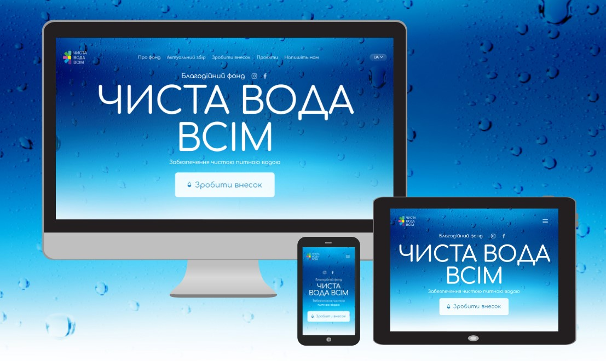

# ЧИСТА ВОДА ВСІМ 💧

[HEY](#hey)

[Жива сторінка](https://clear-water.vercel.app/uk)

Зміст:

1. [Вступ](#опис проєкту)
2. [Інструкція з встановлення](#Доступність)
Використання
Приклади
Завдання та питання

## Опис Проєкту

Ласкаво просимо до репозиторію "Чиста вода всім", який містить вихідний код та
ресурси для цього веб-сайту! "Чиста вода всім" - це благодійний фонд, який
зосереджений на забезпеченні чистої питної води для всіх, незалежно від місця
проживання чи соціального статусу, та залучення коштів для системи очищення
води.

## 📊 Переваги

- Оптимізація: Веб-сайт "Чиста вода всім" оптимізований для швидкого
  завантаження, забезпечуючи користувачам швидкий доступ до інформації.

  

- Модульність та повторне використання: Цей веб-сайт розроблено з використанням
  компонентного підходу, що робить код модульним і дозволяє використовувати
  компоненти на різних сторінках та в різних проектах. Це спрощує підтримку
  сайту і розширення його функціональності.

- Лінтери та форматування: Використання таких інструментів, як Prettier і
  ESLint, допомагає зберігати стандарти коду, забезпечує послідовний стиль і
  виявляє потенційні проблеми в коді.

- Адаптивність: Веб-сайт адаптивний, що дозволяє створювати динамічні та
  інтерактивні інтерфейси користувача без перезавантаження сторінок. Це підвищує
  залучення та взаємодію користувачів.

- Зручне управління контентом: Система управління контентом має інтуїтивно
  зрозумілий інтерфейс, що спрощує процес оновлення та редагування контенту. Ви
  можете легко вносити зміни в тексти, зображення та інший вміст, не потребуючи
  спеціальних знань у веб-розробці.

## Доступність

- Інтуїтивно зрозумілий дизайн
- Семантичний HTML
- Зручний для мобільних пристроїв
- Веб-ресурс доступний для будь-якого девайсу, що має підключення до Інтернету

## 🛠️ Технічний стек

- Next.js 13
- TailwindCSS
- GraphQL
- Axios
- React Hook Form
- React-scroll
- React responsive
- Headless UI
- Swiper
- Yup
- Copy-to-clipboard
- EsLint
- PropTypes
- DatoCMS (адмінпанель)

## 🌐 Мови, що підтримуються

- Українська
- Англійська

## 🚀 Розгортання проєкту

1. Склонуйте репозиторій: ` https://github.com/SoftRyzen-internship/pure-water`
2. Перейдіть до папки проєкту: `cd pure-water`
3. Встановіть залежності: `npm install` or `yarn install`
4. Запустіть додаток: `npm run dev` or ` yarn dev`
5. Переглядайте веб-сайт локально за посиланням: `http://localhost:3000`

## Адмінпанель

[Адмінпанель](https://pure-water.admin.datocms.com/editor)

Адмін-панель дозволяє оперативно змінювати (редагувати, додавати, видаляти)
контент секцій Актуальний збір та Проєкти на сайті без внесення змін до коду.

[Інструкція до адмінпанелі DatoCMS](./README.admin.md)

